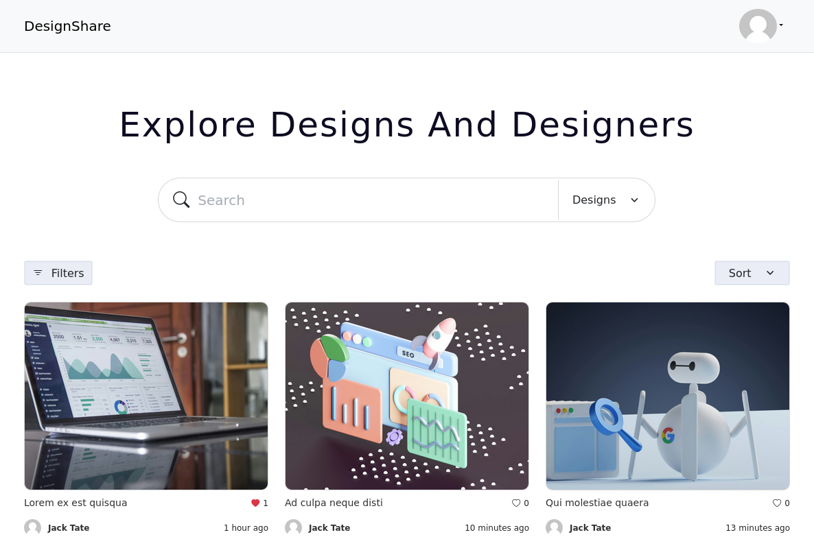

<p><a href="designshare.uk.to" target="_blank">DesignShare</a></p>

# DesignShare - Frontend

DesignShare is a platform where designers can share their designs. This repository contains the Vue.js frontend for the DesignShare application.

## Project Setup

```sh
npm install
```

### Compile and Hot-Reload for Development

```sh
npm run dev
```

### Compile and Minify for Production

```sh
npm run build
```

## Customize configuration

See [Vite Configuration Reference](https://vitejs.dev/config/).